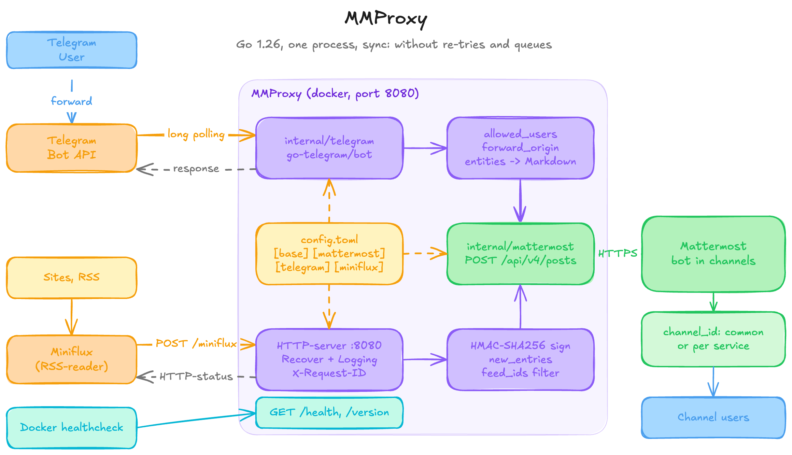

# MMProxy


MMProxy proxies messages into a Mattermost channel from two independent sources:

- **Telegram bot** — forward any message to the bot and it republishes the text into Mattermost.
- **Miniflux webhook** — Miniflux pushes new feed entries; MMProxy posts them.

Each source is optional; enable one or both. Processing is synchronous and retry-free: delivery errors are returned to
the caller.



## Endpoints

| Method & path    | Purpose                                                           |
|------------------|-------------------------------------------------------------------|
| `GET /health`    | Liveness probe, returns `200 OK`.                                 |
| `GET /version`   | Build info line: name, version, revision, Go version, build date. |
| `POST /miniflux` | Miniflux webhook receiver (only when the source is enabled).      |

## Quick start

```bash
# 1. Prepare the config
cp docs/config.toml config.toml
$EDITOR config.toml            # fill in Mattermost / Telegram / Miniflux values

# 2. Build and run
make build
./mmproxy -version                # build info, no config needed
./mmproxy -config config.toml
```

Check it:

```bash
curl -i localhost:8080/health     # 200 OK
curl -s localhost:8080/version    # MMProxy: v0.0.1 git:195a144 go1.26.5 2026-07-15T09:39:45
```

### Docker

```bash
cp docs/config.toml config.toml   # edit it, then:
make docker                       # z0rr0/mmproxy:latest and :<git tag>, host arch
docker compose up -d
```

Or straight from [Docker Hub](https://hub.docker.com/r/z0rr0/mmproxy), no build step and no Go toolchain needed:

```bash
docker compose pull && docker compose up -d
```

Publishing a new image (`linux/amd64` + `linux/arm64`) requires a Docker Hub login and a git tag — the version tag comes
from the same `git tag` that feeds the build metadata, so an untagged tree is refused:

```bash
docker login
make docker-push
```

`make docker` builds only for the host architecture: the default Docker Desktop builder cannot export a multi-arch
manifest list locally. `make docker-push`
therefore builds on its own `docker-container` builder — created automatically on first use — and pushes directly to the
registry.

The compose file mounts `./config.toml` read-only at `/data/config.toml`, checks
`/health` on the default internal port 8080, and restarts the container
`unless-stopped`. Docker records an unhealthy status but does not restart a running unhealthy container solely because
of the health check.

## Configuration

TOML, passed via `-config` (default `config.toml`). See
[`docs/config.toml`](docs/config.toml) for the annotated example. Key points:

- `[mattermost]` `url`, `token`, `channel_id` are always required. Prefer a dedicated bot account that is a member of
  the target channel.
- `[telegram]` is enabled when `token` is set; `allowed_users` (numeric Telegram IDs) is then required. Empty per-source
  `channel_id` falls back to the shared Mattermost channel.
- `[miniflux]` is enabled when `webhook_secret` is set. Requests are authenticated by the `X-Miniflux-Signature`
  HMAC-SHA256 header. `feed_ids`
  optionally restricts which feeds are accepted.
- Timeouts are Go duration strings: `[base]` `read_timeout`,
  `read_header_timeout`, `write_timeout`, `idle_timeout`, `shutdown_timeout` and
  `[mattermost]` `timeout`. Each is optional and falls back to its default;
  `base.write_timeout` must exceed `mattermost.timeout`, otherwise startup fails.
- `[mattermost]` `max_message_runes` caps a post length in runes (not bytes); longer messages are truncated with an
  ellipsis. Optional, default 16383 — the Mattermost `MaxPostSize` default. Raise it to match a server configured for
  longer posts. Like the timeouts, an omitted key or `0` means the default.

See [`docs/notes.md`](docs/notes.md) for message formats, webhook response codes and the v1 trade-offs.

## Development

```bash
make fmt         # gofmt
make lint        # gofmt check + go vet + golangci-lint + non-blocking govulncheck
make vuln        # informational govulncheck (never blocks the build)
make test        # lint + go test -race -cover ./...
make build       # binary with version, revision and build date via ldflags
make docker      # z0rr0/mmproxy:latest and :<git tag>, host arch, loaded locally
make docker-push # multi-arch (amd64 + arm64) build pushed to Docker Hub
make clean
```

Requires Go 1.26 and (for linting) `golangci-lint`. GitHub Actions runs build, vet, race-enabled tests and lint on
pushes and pull requests to `main`;
`govulncheck` is reported separately without blocking CI.

## License

This source code is governed by a [MIT](https://opensource.org/license/MIT)
license that can be found in the [LICENSE](https://github.com/z0rr0/mmproxy/blob/main/LICENSE) file.
